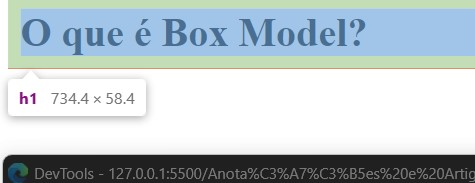

## Box Model e Box Sizing

Todos os elementos/tags no html são exibidos de forma retangular ou quadrados, se assim forem definidas suas propriedades. Eles implementam o box model (modelo de caixa) nada mais é que o total de espaço que o elemento ocupa na tela, e ter noções das variáveis que alteram esse total de espaço é importante.

_Margin_ , _border_ e _padding_.
Usando o DevTools:


- Em azul: Representa o tamanho que o conteudo textual ocupa.
- Em laranja: A margem que o elemento está ocupando na tela.

Ao posicionar o mouse no site ou no codigo html do mesmo ele vai dizer o quanto cada um ocupa.
Alterando as propriedades _Margin_ e _border_.
````css
h1 {
    margin: 0;
    border: 10px solid blue;
}
````

Antes:


Depois ...
Somou a altura do elemento com a borda. 


Alterando novamente: 

````css
h1 {
    margin: 0;
    border-bottom: 1px solid tomato;
}
````

resultado: 


Podemos usar os botões de marcação para ver como ficaria sem/com alguns elementos:


Outra propriedade a ser editada é o _padding_ que causa um espaçamento interno entre a borda do elemento e o texto.




## Box Sizing

````css
    height: 100px;
    width: 100px;
````

Alterou o tamanho do elemento. Porem ele ultrapassou os 100px. Para garantir que ele vai ter o tamanho especificado usamos o boxSizing.


````css
    height: 100px;
    width: 100px;
    box-sizing: border-box;
````
Neste exemplo acima o conteúdo não coube e terminou havendo um transbordamento pela borda do elemento/overflow.


